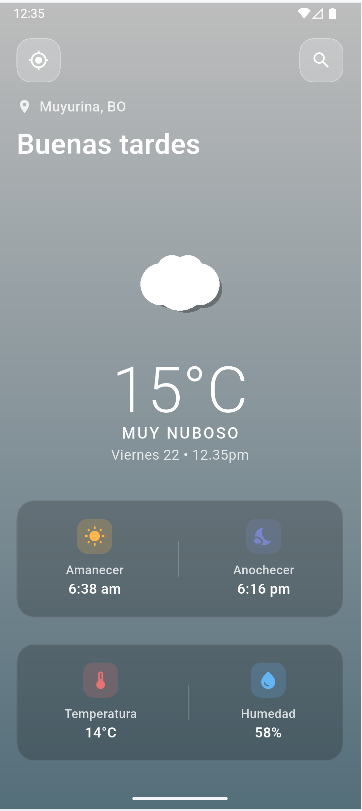

# 🌤️ Weather App - Aplicación del Clima

Una aplicación moderna de clima desarrollada con Flutter que muestra información meteorológica en tiempo real con una interfaz elegante y funcional.

## ✨ Características

- 🎯 **Geolocalización automática** - Detecta automáticamente tu ubicación al iniciar
- 🔍 **Búsqueda de ciudades** - Busca el clima de cualquier ciudad del mundo
- 🎨 **Interfaz moderna** - Diseño glassmorphism con gradientes dinámicos
- 🌈 **Gradientes adaptativos** - Los colores cambian según las condiciones climáticas
- ☀️ **Información completa** - Temperatura, sensación térmica, humedad, viento, amanecer/atardecer
- 🎭 **Iconos 3D personalizados** - Iconos del clima dibujados con CustomPainter
- 📱 **Diseño responsive** - Optimizado para diferentes tamaños de pantalla
- 🔄 **Animaciones suaves** - Transiciones elegantes entre estados
- 🌍 **Zona horaria inteligente** - Amanecer/atardecer en hora local de cada ciudad

## 🛠️ Tecnologías Utilizadas

- **Flutter** - Framework de desarrollo
- **Dart** - Lenguaje de programación
- **OpenWeatherMap API** - Datos meteorológicos
- **Geolocator** - Servicios de geolocalización
- **HTTP** - Peticiones a la API
- **Flutter DotEnv** - Manejo de variables de entorno
- **Permission Handler** - Gestión de permisos

## 📸 Capturas de Pantalla

